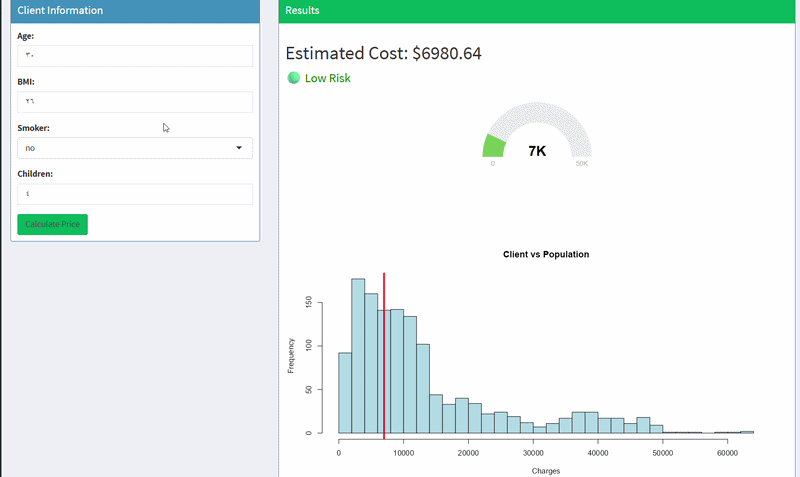

# Actuarial Cost Prediction & Risk Modeling (Gamma GLM + Shiny)

## Overview

This project develops an end-to-end actuarial cost prediction and pricing support system for health insurance, translating statistical modeling (Gamma GLM) into a practical decision-making tool through an interactive Shiny dashboard.

## Key Visualizations
The following visualizations highlight the key patterns and risk drivers identified in the data:

### 1. Distribution of Medical Charges

  

Medical insurance costs exhibit a strong right-skewed distribution, with a small number of individuals incurring very high expenses. This distribution justifies the use of a Gamma GLM, which is well-suited for modeling positive and skewed data.

---

### 2. Impact of Smoking on Costs

  

Smoking is the most significant driver of medical costs. Smokers incur substantially higher charges compared to non-smokers, with a clear separation between the two groups. This highlights smoking as a key risk factor in pricing.

---

### 3. Interaction Between BMI and Smoking

  

The effect of BMI on medical costs differs significantly between smokers and non-smokers. While BMI has a moderate impact on non-smokers, it leads to a sharp increase in costs among smokers, indicating a strong interaction effect between these variables.

## 🎥 Demo

  

## Objectives

* Predict individual insurance costs based on risk factors
* Segment customers into risk categories (Low, Medium, High)
* Analyze portfolio-level risk distribution
* Build an interactive cost prediction and pricing support tool

## Dataset

The dataset contains information on policyholders, including:

* Age
* BMI (Body Mass Index)
* Smoking status
* Number of children
* Medical insurance charges (target variable)

## Methodology

### 1. Exploratory Data Analysis (EDA)

* Identified skewed distribution of insurance costs
* Detected strong impact of smoking on costs
* Observed interaction effects between BMI and smoking

### 2. Feature Engineering

* Created interaction terms (BMI × Smoking)
* Applied log transformation to handle skewness
* Segmented variables for better interpretability

### 3. Modeling

* Built multiple models for comparison:

  * Linear Regression
  * Log-Linear Model
  * Gamma GLM (final model)

* Selected Gamma GLM due to:

  * Positive and skewed nature of cost data
  * Better statistical fit (AIC comparison)
  * Interpretability in actuarial context

### 4. Prediction System

* Developed reusable functions for:

  * Individual prediction
  * Risk classification
  * Batch prediction (portfolio-level analysis)

### 5. Portfolio Analysis

* Evaluated risk distribution across policyholders
* Identified concentration of costs among high-risk groups
* Analyzed contribution of smoking to overall risk

### 6. Shiny Dashboard

* Built an interactive dashboard for:

  * Real-time cost prediction
  * Risk classification
  * Visualization of client position within the portfolio

## Key Insights

* Smoking is the most significant risk driver
* High-risk individuals contribute disproportionately to total costs
* Clear segmentation exists between low-risk and high-risk groups
* Cost distribution is highly skewed, justifying the use of Gamma GLM
* Smoking significantly amplifies the impact of BMI on costs, indicating a strong interaction effect

## Business Value

The model estimates expected insurance costs and supports pricing decisions by identifying high-risk policyholders who contribute disproportionately to total costs.

## Model Validation

The model was evaluated using prediction error metrics such as Mean Squared Prediction Error (MSPE), ensuring reliable cost estimation and model performance.

## Tools & Technologies

* R (data analysis, modeling)
* Gamma GLM (statistical modeling)
* Shiny (interactive dashboard)
* GitHub (version control)

## Project Structure

* `data/` → dataset
* `R/` → data processing, modeling, and functions
* `app/` → Shiny dashboard
* `outputs/` → prediction results

## Future Improvements

* API deployment for real-time pricing
* Advanced feature engineering
* Model validation and performance metrics
* Integration with external data sources

## Author

[Amjad Alsurayyi]
