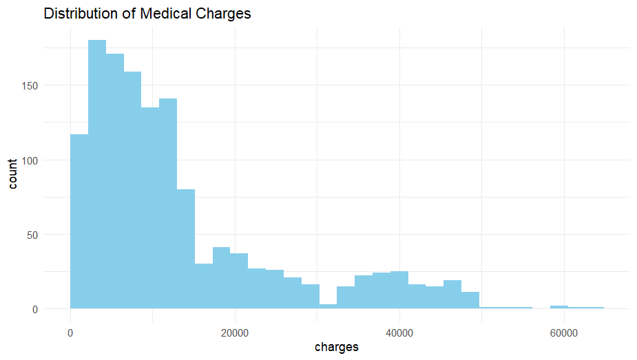
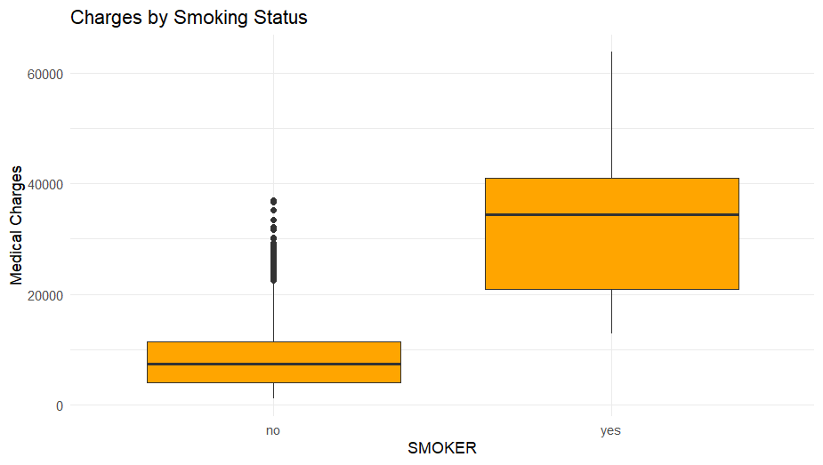
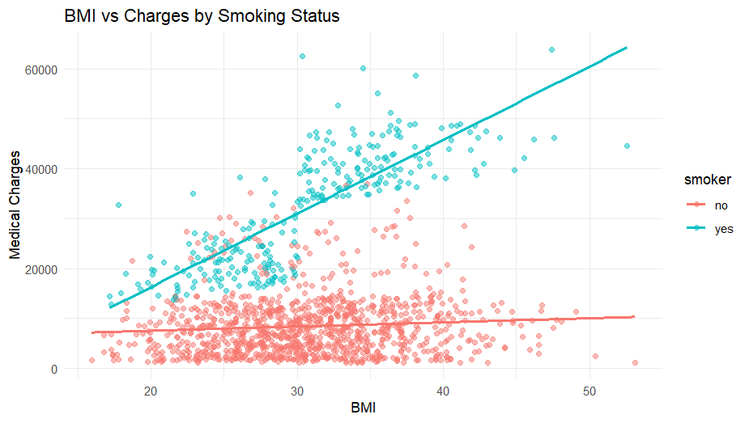
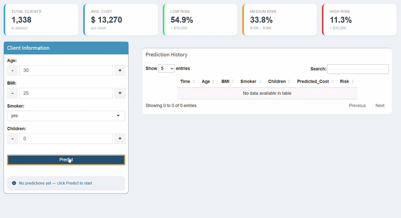

# Actuarial Cost Prediction & Risk Modeling (Gamma GLM + Shiny)

## Overview

This project develops an end-to-end actuarial cost prediction and pricing support system for health insurance.
It bridges statistical modeling (Gamma GLM) with a practical decision-support tool through an interactive Shiny dashboard.

## Key Visualizations
The following visualizations highlight the key patterns and risk drivers identified in the data:

### 1. Distribution of Medical Charges

  

 

Medical costs are highly right-skewed, with a small number of individuals incurring very high expenses.
This supports the use of Gamma GLM, which is designed for positive, skewed data.

---

### 2. Impact of Smoking on Costs

  

Smoking is the most significant driver of medical costs, with clear separation between smokers and non-smokers.

---

### 3. Interaction Between BMI and Smoking

  

BMI has a significantly stronger effect on costs for smokers, indicating a clear interaction effect.

---

## 🎥 Demo

  

## Objectives

* Objectives
* Predict individual insurance costs based on risk factors
* Segment customers into risk categories (Low, Medium, High)
* Analyze portfolio-level risk distribution
* Build an interactive cost prediction and pricing support tool

## Dataset

The dataset contains information on policyholders, including:

* Age
* BMI (Body Mass Index)
* Smoking status
* Number of children
* Medical insurance charges (target variable)

https://www.kaggle.com/datasets/mirichoi0218/insurance

## Methodology

## 1. Exploratory Data Analysis (EDA)
* Identified skewed cost distribution
* Detected strong impact of smoking
* Observed interaction effects between BMI and smoking
  
## 2. Feature Engineering
* Created interaction terms (BMI × Smoking)
* Applied transformations to handle skewness
* Prepared categorical variables for modeling

### 3. Modeling

Multiple models were evaluated:

* Linear Regression
* Log-Linear Model
* Gamma GLM (final model)

Models were compared using:

**MSPE (Mean Squared Prediction Error)**
**MAE (Mean Absolute Error)**
**AIC (Akaike Information Criterion)**

👉 Although the linear model showed slightly better prediction accuracy (MSPE),
the Gamma GLM was selected because:

* It better reflects the positive and skewed nature of insurance costs
* It provides more appropriate actuarial interpretation
* It balances statistical fit and real-world applicability

## 4. Prediction System

Reusable functions were developed for:

* Individual predictions
* Risk classification
* Batch predictions (portfolio-level analysis)

## 5. Portfolio Analysis
* Evaluated risk distribution across policyholders
* Measured cost contribution by risk segment
* Identified concentration of costs in high-risk groups
* Analyzed relationship between smoking and risk

## 6. Shiny Dashboard

The interactive dashboard provides:

* Real-time cost prediction
* Risk classification
* Peer comparison within the portfolio
* Prediction history tracking
* Export of results as CSV

## Key Insights

* Smoking is the strongest risk driver
* High-risk clients contribute disproportionately to total costs
* Clear segmentation exists between risk groups
* Cost distribution is highly skewed
* BMI impact is amplified among smokers

## Business Value

The system supports pricing decisions by estimating expected costs and identifying high-risk clients.

## Model Validation

The model was evaluated using prediction error metrics such as Mean Squared Prediction Error (MSPE), ensuring reliable cost estimation and model performance.

## Tools & Technologies

* R (data analysis, modeling)
* Gamma GLM (statistical modeling)
* Shiny (interactive dashboard)

## Project Structure

* data/ → raw dataset
* R/ → data preparation and prediction functions
* app/ → Shiny dashboard (UI + model deployment)
* scripts/ → model training and portfolio analysis
* images/ → visualizations and demo
* outputs/ → generated prediction results

## Author

[Amjad Alsurayyi]
